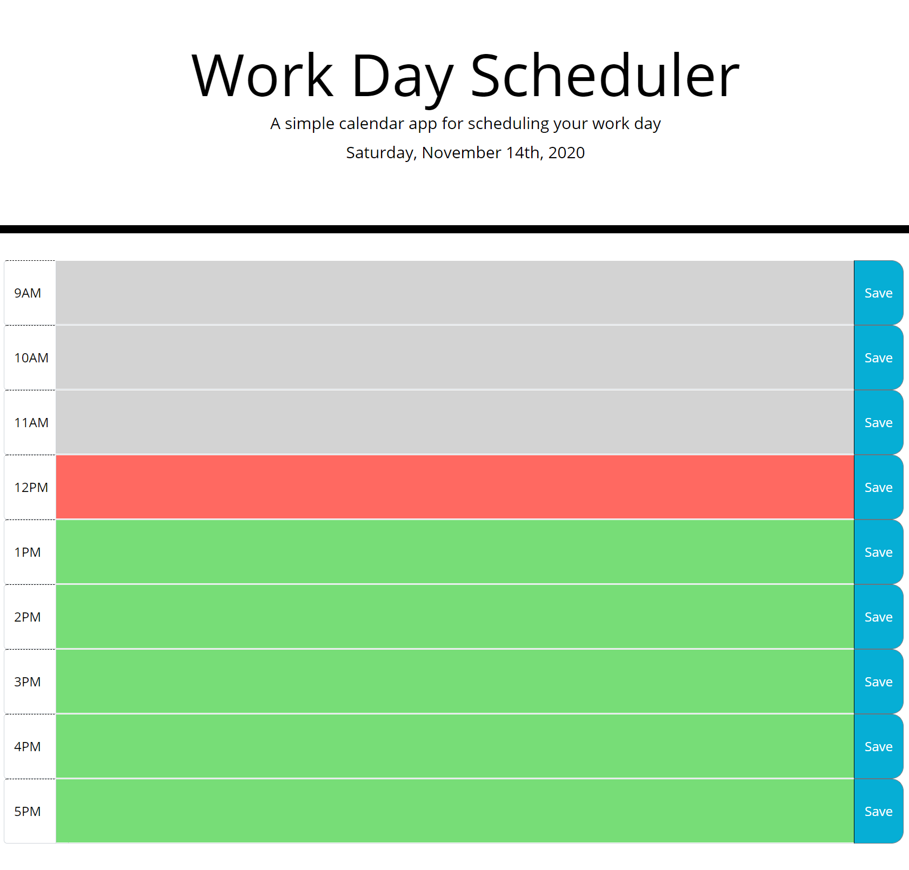

# Title: # 05-Work-Day-Scheduler-Dan-Aument-UT-Homework

## Table of Contents:
* [Description](#Description)
* [Screenshot](#Screenshot)
* [Location of Deployed Project](#Location)
* [Notes from Dan](#Notes)
* [Credits](#Credits)
* [License](#License)

### <a name="Description">Description:</a>
This project serves as a homework assignment submission for the fifth week of UT's web dev coding bootcamp.  It contains a codebase and a deployed webpage for a day planner web app.

### <a name="Screenshot">Screenshot: </a>

### <a name="Location">Location of Deployed Project:</a>
https://danaument.github.io/work-day-scheduler/

### <a name="Notes">Notes from Dan:  </a>

This assignment took me considerably less time to complete than previous assignments.  I had some issues understanding how and where to use some of the CSS class styles that were provided with the assignment. I ended up modifying them somewhat to make my app look as close to the provided gif as possible.  

I had originally intended to include all of my saved data values in session storage within an object, where each day got an object.  Perhaps I will add multiday support at some point in the future.  I had some difficulty with this object approach, and an askBCS learning assistant steered me toward using one session storage key per time slot.

### <a name="Credits">Credits: </a>
This project was completed by Dan Aument using code and assets provided by The Coding Boot Camp at UT Austin in partnership with Trilogy Education Services. 

### <a name="License">License: </a>

Distributed under the MIT License

MIT License

Copyright (c) 2020 Daniel Aument

Permission is hereby granted, free of charge, to any person obtaining a copy
of this software and associated documentation files (the "Software"), to deal
in the Software without restriction, including without limitation the rights
to use, copy, modify, merge, publish, distribute, sublicense, and/or sell
copies of the Software, and to permit persons to whom the Software is
furnished to do so, subject to the following conditions:

The above copyright notice and this permission notice shall be included in all
copies or substantial portions of the Software.

THE SOFTWARE IS PROVIDED "AS IS", WITHOUT WARRANTY OF ANY KIND, EXPRESS OR
IMPLIED, INCLUDING BUT NOT LIMITED TO THE WARRANTIES OF MERCHANTABILITY,
FITNESS FOR A PARTICULAR PURPOSE AND NONINFRINGEMENT. IN NO EVENT SHALL THE
AUTHORS OR COPYRIGHT HOLDERS BE LIABLE FOR ANY CLAIM, DAMAGES OR OTHER
LIABILITY, WHETHER IN AN ACTION OF CONTRACT, TORT OR OTHERWISE, ARISING FROM,
OUT OF OR IN CONNECTION WITH THE SOFTWARE OR THE USE OR OTHER DEALINGS IN THE
SOFTWARE.